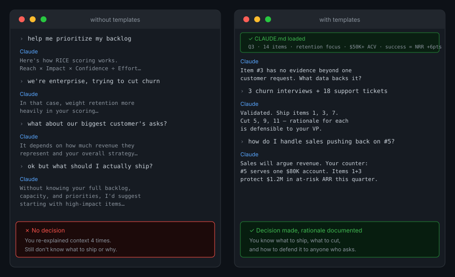

# A way to build the right thing

Templates for PMs working with Claude. Before Claude helps you write a spec, rank a backlog, or plan a launch, it makes you answer whether you should be doing it at all.

---

---

## What this is

Five CLAUDE.md templates, one per common PM problem type. You copy the right one into your project folder, fill it in, and Claude loads it automatically when you start a session.

The templates ask harder questions than most briefs do: what is your hypothesis, what evidence do you have, who specifically has this problem, what does success look like in 90 days. If your answers are thin, Claude will say so before doing any work.

The goal is to stop building things on a hunch, because someone important asked, or because you can. And start building things because there is a real problem worth solving.

---

## Templates

**Before you build**

| Template | Use when |
|----------|---------|
| [`templates/problem-clarity.md`](templates/problem-clarity.md) | Auditing how well you actually understand a problem before committing to a direction |
| [`templates/discovery.md`](templates/discovery.md) | User research, problem framing, opportunity sizing |
| [`templates/feature-validation.md`](templates/feature-validation.md) | Testing whether a feature idea is worth building |
| [`templates/competitive-response.md`](templates/competitive-response.md) | Figuring out whether a competitor move is a real threat and what to do about it |

**Deciding what to build**

| Template | Use when |
|----------|---------|
| [`templates/prioritization.md`](templates/prioritization.md) | Ranking features, backlog tradeoffs, roadmap decisions |
| [`templates/build-vs-buy.md`](templates/build-vs-buy.md) | Vendor evaluation, make-or-buy decisions |
| [`templates/roadmap.md`](templates/roadmap.md) | Roadmap narrative, stakeholder alignment, planning cycles |
| [`templates/stakeholder-alignment.md`](templates/stakeholder-alignment.md) | Getting multiple stakeholders to a decision |

**Building it**

| Template | Use when |
|----------|---------|
| [`templates/prd.md`](templates/prd.md) | Writing a product requirements document |
| [`templates/gtm.md`](templates/gtm.md) | Launch planning, positioning, pricing, enablement |

**After you ship**

| Template | Use when |
|----------|---------|
| [`templates/post-launch-review.md`](templates/post-launch-review.md) | Reviewing whether the hypothesis was right and what you learned |
| [`templates/churn-diagnosis.md`](templates/churn-diagnosis.md) | Figuring out why customers are leaving |

---

## How to use one

1. Copy the template for your problem type into your working folder as `CLAUDE.md`
2. Fill in every section
3. Open Claude Code in that folder — it picks up the file automatically
4. Start working

---

## Tools you need

Claude Code, a text editor, and this repo. That is it.

| Tool | Why |
|------|-----|
| Claude Code (CLI) | Loads CLAUDE.md automatically at session start |
| VS Code or Cursor | Edit the brief and your work in the same window |
| Obsidian (optional) | Good place to keep running notes about your product and users that you pull from when filling in a brief |

---

## Contributing

Add a template by opening a PR with the file in `templates/`, a row in the table above, and at least one filled-in example in a comment block at the bottom of the template.

